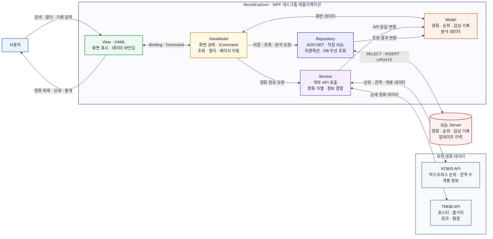

# MovieExplorer 시스템 아키텍처

## 핵심 흐름

1. 사용자의 입력은 XAML View에서 Command와 양방향 바인딩을 통해 ViewModel로 전달됩니다.
2. ViewModel은 외부 영화 정보가 필요하면 Service를, 저장·조회·통계가 필요하면 Repository를 호출합니다.
3. Service는 KOBIS 영화와 TMDB 상세 정보를 검증·결합하여 Model로 반환합니다.
4. Repository는 ADO.NET과 매개변수화 SQL로 SQL Server 데이터를 처리합니다.
5. ViewModel이 반환된 데이터와 화면 상태를 갱신하면 View가 자동으로 변경됩니다.

